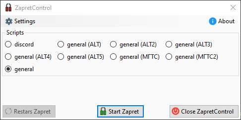
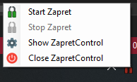

# ZapretControl - GUI for [zapret-discord-youtube](https://github.com/Flowseal/zapret-discord-youtube)

Небольшой GUI для запуска скриптов для Zapret

Исполняемый файл и скрипты взяты напрямую из оригинального репозитория через git submodule.

## Скриншоты

Основное окно  

Меню в трее  

## Links

- **[zapret-discord-youtube](https://github.com/Flowseal/zapret-discord-youtube)** by @Flowseal
- **[zapret](https://github.com/bol-van/zapret)** by @bol-van
- **[WinDivert](https://github.com/basil00/Divert)** by @basil00
