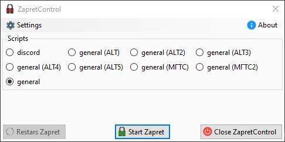
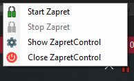

# ZapretControl - GUI for [zapret-discord-youtube](https://github.com/Flowseal/zapret-discord-youtube)

A small GUI application to running scripts for Zapret

The executable and scripts are taken directly from the original repository via git submodule.

## Screenshots

Main window  


Tray menu  


## Notes

* .NET 6 - Windows 7 ([Needs old WinDivert][win7])
* .NET 8 - Windows 10+

```sh
# Updating submodule
git submodule update --recursive --remote
```

```sh
# Local publish (Publish to folder is broken in VS)
dotnet publish -c Release -p:PublishProfile=net6 -f net6.0-windows /property:Version=1.*.*
dotnet publish -c Release -p:PublishProfile=net8 -f net8.0-windows /property:Version=1.*.*
```

## Links

* **[zapret-discord-youtube](https://github.com/Flowseal/zapret-discord-youtube)** by @Flowseal
* **[zapret](https://github.com/bol-van/zapret)** by @bol-van
* **[WinDivert](https://github.com/basil00/Divert)** by @basil00

<!-- URL -->
[win7]: https://github.com/Flowseal/zapret-discord-youtube?tab=readme-ov-file#требуется-цифровая-подпись-драйвера-windivert-windows-7
