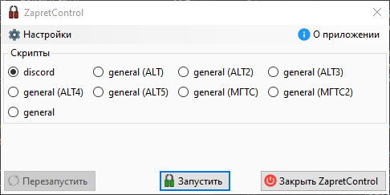
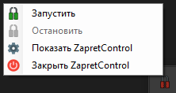

# ZapretControl - GUI для [zapret-discord-youtube](https://github.com/Flowseal/zapret-discord-youtube)

Небольшой GUI для запуска скриптов для Zapret

Исполняемый файл и скрипты взяты напрямую из оригинального репозитория через git submodule.

## Скриншоты

Основное окно  


Меню в трее  


## Заметки

* .NET 6 - Windows 7 ([Нужен старый WinDivert][win7])
* .NET 8 - Windows 10+

```sh
# Обновление submodule
git submodule update --recursive --remote
```

## Ссылки

* **[zapret-discord-youtube](https://github.com/Flowseal/zapret-discord-youtube)** by @Flowseal
* **[zapret](https://github.com/bol-van/zapret)** by @bol-van
* **[WinDivert](https://github.com/basil00/Divert)** by @basil00

<!-- URL -->
[win7]: https://github.com/Flowseal/zapret-discord-youtube?tab=readme-ov-file#требуется-цифровая-подпись-драйвера-windivert-windows-7
